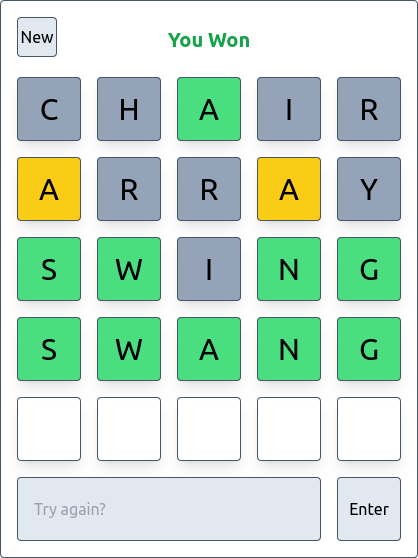

# Wordle

This Wordle game was made as a challenge.

It uses **Preact** with the **Vite** framework and **TailwindCSS**.



## Running

A random word API url is configured in the `.env` file of the workspace. If you want to change it you can define it in a
`.env.local` file.

To run the project and access it on port 5173:

```sh
npm start
```

To make a production build:

```sh
npm run build
```
